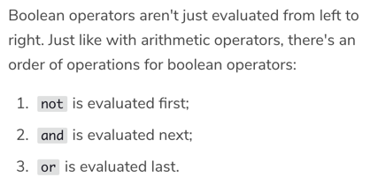
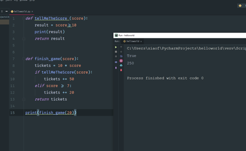

# 一、教材：Python_QuickStart

## 1.代码块要坚持使用4个空格的缩进，不混用 tab 和空格
## 2.数据类型：整数（十六进制比较方便），浮点数（小数；浮点数运算可能会有四舍五入的误差），字符串
## 3.浮点数计算不精确的解决办法：使用Decimal模块 
## 4.基本含义：
#eof	end of file 标记程序结束是一个好习惯
%	余数
// 	相除后的整数部分
int	整数
str	字符串
bool	布尔值
float	浮点数
type	数据类型

## 5.序列
[]	序列
* a[0]	a 序列中的0号数据——下标访问
* a[0:3]	a 序列中0到3（不包括3）号数据——切片slice操作
* len[a]	序列 a 的长度（数据个数）
* a.count(7)	括号内数字在序列a中出现的次数
* a.index(7)	括号内数字在序列 a 中第一次出现的位置
* a.index(7,3)	7在序列 a 中编号为3的位置后面第一次出现的位置
* a.index(7,1,5)	7在序列a 中1位置之后和5位置之前第一次出现的位置
* ”“” “”“	定义一个字符串
* range(start,end,step)	step默认为1
* range(10)[3:6]	range 切片
* 🌟range和list的区别：如果想输出一个序列，必须要在 range 前加 list，range 只能表示一个取值范围，不是一个序列形式。
## 6.☝️：如何实现int list当中所有的偶数都乘以2奇数保持不变？

## 7.input函数
input 中的内容会被自动认作为字符串，如果想数学运算，必须用int函数或者float函数转换

## 8.print函数


Codecademy:
CS
MIT review  
Readhub.me
https://techcrunch.com/events/disrupt-sf-2019/
https://www.codecademy.com/learn/learn-python

# Python
## 1. print statement: 
python 2: print””
python 3:print(“”)

## 2. Updating variables
False: e += a+b+c
True: e += a
e += b 
e += c
## 3. space!!!
## 4. Methods that use dot notation only work with strings.
## 5. always count from ZERO
## 6. 

## 7. 在得知最终计算结果之前先得知中间步骤的结果

## 8. list: .sort() modifies the list rather than returning a new list
list slicing return a new list

## 9. 
Learn Python 2
Lesson: A Day at the Supermarket 
## 11. Making a purchase:

``` shopping_list = ["banana", "orange", "apple"]

stock = {
  "banana": 6,
  "apple": 0,
  "orange": 32,
  "pear": 15
}
    
prices = {
  "banana": 4,
  "apple": 2,
  "orange": 1.5,
  "pear": 3
}
```

 Write your code below!
```
def compute_bill(food):
  total = 0
  for item in food:
    total = total + prices[item]
  return total
  ```

## 10. Bitwise
Keep in mind that after using the bin function, you can no longer operate on the value like a number.

~) just flips all of the bits in a single number. this is equivalent to adding one to the number and then making it negative.

## 11. Bit mask 基层操作 不常用
## 12. I/O:
You can open files in any of the following modes:
* 	write-only mode ("w")
* 	read-only mode ("r")
* 	read and write mode ("r+")
* 	append mode ("a"), which adds any new data you write to the file to the end of the file.
## 13. Install package
http://pip.readthedocs.org/en/stable/installing/
download get-pip.py
Terminal:
	python3 get-pip.py
	pip3 install numpy

## 14. import package
```
import numpy
you must call the function inside the numpy by:
	numpy.array([1,2,3])
or import numpy as np
then you can call the function by:
	np.array() n
or from numpy import array
then you can simply use
	array()
```
## 15. Numpy
Numeric Python
* Alternative to Python List: Numpy Array— similar to list but have some additional functions
* Calculations over entire arrays
* numpy.array() #turn the list in to numpy array
* num arrays: contain only one type
* Numpy is a new type(numpy.ndarray), it has it’s own method
* xx.shape — to see the dimension of the array
* subsetting: xx[0][2] or xx[0,2]
* xx[:, 1:3] want the entire rows and 1, 2 column
* xx[1,:] want the 1 row and all the column